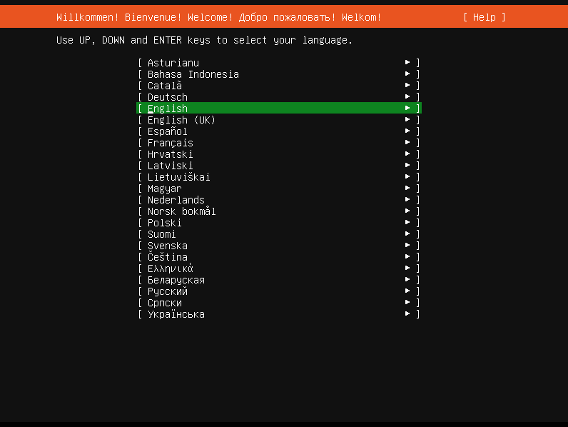

# Installing YTL Linux

YTL Linux installs:
 * Ubuntu server with Cinnamon desktop environment. Cinnamon was selected
   as it might be more familiar with Windows users than some other desktop
   environments.
 * A metapackage `ytl-linux-customize` installs a tested Oracle VirtualBox
   version and some smaller tools. It also contains
 * Users for the school and MEB. However, the MEB account is currently disabled.

## Instructions

 1. Download [the installation image](https://linux.abitti.fi/ytl-install-22.iso).
 1. Write the image to an USB stick.
 1. The installation is silent and it overwrites the storage. Make sure your disks do not contain any valuable data.
 1. Connect the server to a wired network. Your network needs to provide network settings from a DHCP server. If your network requires proxy settings or filters traffic you may encounter problems.
 1. Boot the server from the USB stick you created earlier.
 1. Select "Install YTL Ubuntu Server" by pressing Enter. After this there is no way back.
 1. In an early stage of the installation the server checks the USB stick for defected data. Make sure it reports only 1 corrupted file:\
 `Check finished: errors found in 1 files!`
 1. The computer reboots after a successful installation.
 1. Log in (`school` / `school`) and change the password: Menu (bottom-left) > Preferences > Account Details > Password.
 1. In case your screen resolution is bad try: Menu > Preferences > Display: Normal Graphics On Boot. Finally, reboot the server.
 1. Start Naksu to install the virtualised server: Menu > Administration > Naksu (You can pin Naksu icon to bottom panel by right-clicking it > Add to panel)

## What to do if the installation fails

 1. Go through the Frequently observed problems below.
 1. Try again. The installation downloads massive amount of data and there might be outages. The installation is less robust what comes to the network problems.
 1. Try with a different network (e.g. by sharing a network via 4G model). Maybe your ISP blocks or filters data?
 1. Are you using Legacy/BIOS boot? Try enabling SecureBoot instead.
 1. Take some screenshots (again, your mobile phone is your friend here):
   * The screen where the installation finished.
   * Press Alt+F2 > enter command \
     `cat /var/log/curtin/install.log` \
     and take a screenshot.
   * Send these screenshots and your contact information to Abitti support.

## Frequently observed problems

### It asks my language

If the installation ends up asking you about installation language the installation
script does not have a network connection.

Things to consider:
 1. Make sure your network offers network settings via DHCP server to an
    unknown computer. Are you able to get an internet access if you connect
    your private laptop to this network? If so, the network probably is good.
 1. Make sure your network adapter is supported by the install-time kernel.
    After hitting the language dialog open a new console with Alt+F2 and enter
    command `ip a`. This lists your detected network devices. If there are no
    entries starting with `en` (see sample outputs below) you don't have supported
    network devices.
      * Unfortunately the install procedure does not support wireless network devices.
      * Maybe you have an USB Ethernet dongle you could give a try? Remember, the
        lack of device support applies the installation phase only. The installed
        Ubuntu Linux has far more larger variety of supported devices. You need
        the USB Ethernet device for the installation phase only.

In the example above there is one ethernet device (`enp0s3`) but it hasn't received network
settings from the DHCP server.

In the example above the ethernet device `enp0s3` has received network settings (IP
`10.0.2.15`, netmask `/24` and broadcast address `10.0.2.255`).

### Naksu complains about unloaded kernel modules

This problem is caused by unsigned kernel modules while kernel is booted with SecureBoot checking.
The Oracle VirtualBox kernel modules do not have a valid signatures and thus cannot be loaded to the
running kernel.

There are three options to solve this problem.

#### Option 1: Make sure you have SecureBoot enable during installation

In some cases the kernel signatures will be carried out automatically if the SecureBoot has been
enforced throughout the installation. If you have changed the setting during the installation
process you could try to re-install with SecureBoot enabled.

#### Option 2: Disable SecureBoot

As the problem is caused by the SecureBoot checking the obvious solution is to disable this security
feature.

#### Option 3: Create a signature and sign the modules

In this option you create a signature (Machine Owner Key, MOK), add it to your UEFI keys and sign the modules with this signature. Fear not - the Oracle people have made this very automatic.

 1. In some cases the `update-secureboot-policy` is running and causing the signing process to fail. Therefore, start by terminating this process:\
   `sudo killall -TERM update-secureboot-policy`
 1. Now reconfigure the VirtualBox installation:\
   `sudo dpkg-reconfigure virtualbox-7.0`
 1. When asked, enter a short (8+) password which you need only after reboot. "secureboot" is an excellent password for the MOK.
 1. Reboot.
 1. After the reboot you will be asked whether you want to enroll your MOK. This is an example process in some Dell and HP models, but your mileage may vary:
  * Perform MOK Management: Continue boot / Enroll MOK / Enroll key from disk / Enroll hash from disk: "Enroll MOK"
  * Enroll MOK: View key / Continue: "Continue"
  * Enroll the key(s)?: No / Yes: "Yes"
  * Password: [this is the password you invented before the reboot, e.g. "secureboot"]
  * Reboot

After this process your SecureBoot stack and kernel know your MOK. The VirtualBox kernel modules have been signed with MOK.

## What to do if you want to suggest changes and/or additions

 * Contact Abitti support by email. You'll find the contact information from the [Abitti website](https://abitti.fi).
 * Open a [GitHub issue](https://github.com/digabi/ytl-linux/issues).
 * YTL Linux is open source. Make a pull request.
